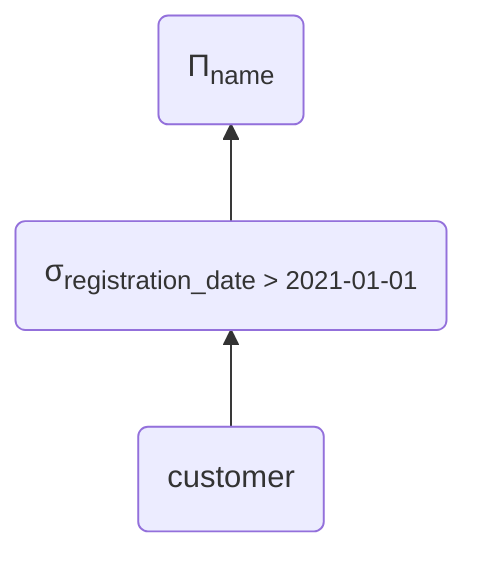
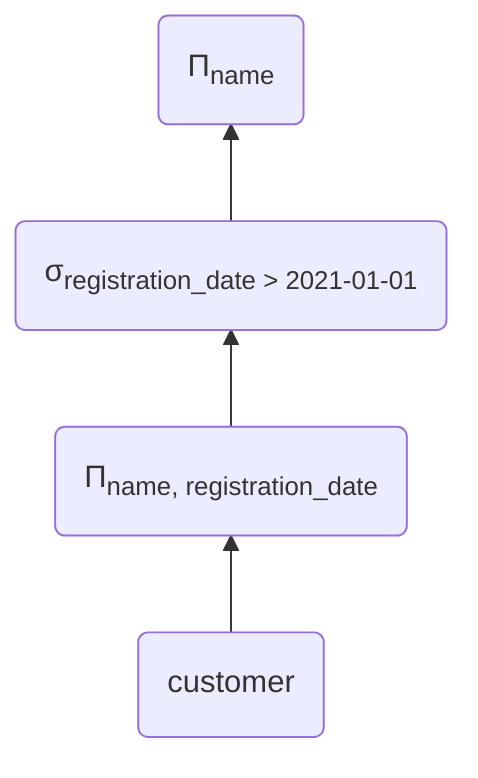
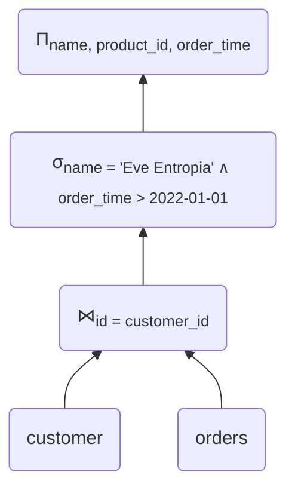
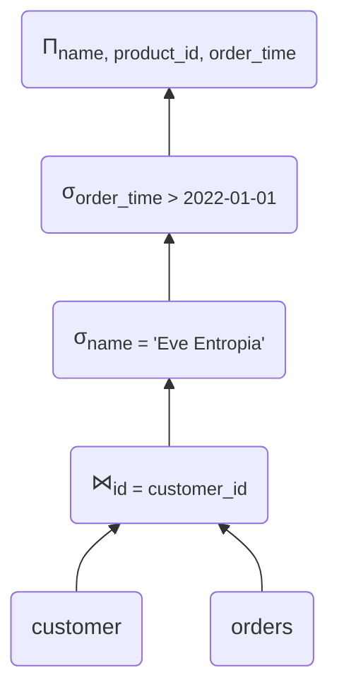
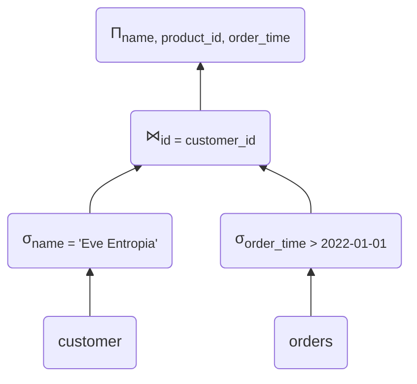
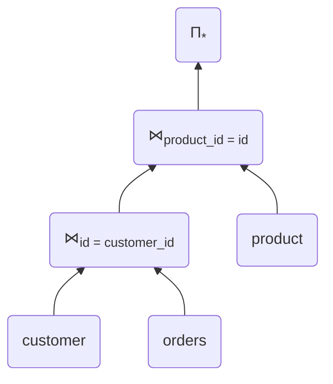
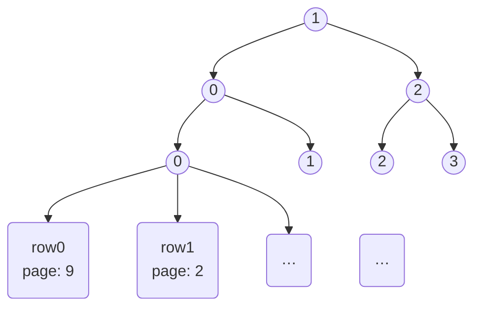

# Postgres Query Planning

<!--
Reset timer!
-->

---
layout: statement
---

# Two parts

## Some fundamentals

## How does Postgres do it?

<!--
* some theory, relational Algebra, some ideas for optimisation
* actual postgres query plans, how to read them, how the planner works
-->

---
layout: section
---

# Part I: Relational Algebra

*yawn*

<!--
* theoretical foundation
* won't go super in depth, but some useful concepts
-->

---
layout: default
---

## A simple database

### `customer`
@src: ./markdown/tables/customer_full.md

<br />

### `orders`
@src: ./markdown/tables/order_full.md

---
layout: two-cols-header
---

## Projection Π

::left::

```sql {|1}
SELECT id, name
FROM customer;
```

::right::

<v-click>

@src: ./markdown/tables/customer_full.md

</v-click>

<v-click>
<div class='text-center text-3xl p-5'>
    <tabler-arrow-down /> Π<sub>id, name</sub>
</div>

@src: ./markdown/tables/customer_projected.md
</v-click>

<!--
* Symbol used for operator: uppercase Pi
* Arguments (columns) given in subscript
* looks funny in some fonts
* corresponds to SELECT part
* Start with all table rows (and columns), project down to some
-->

---
layout: two-cols-header
---

## Selection σ

::left::

```sql {|3}
SELECT id, name
FROM customer
WHERE registration_date > 2021-01-01;
```

::right::

<v-click>

@src: ./markdown/tables/customer_full.md
</v-click>

<v-click>
<div class='text-center text-3xl p-5'>
    <tabler-arrow-down /> σ<sub>registration_date > 2021-01-01</sub>
</div>

@src: ./markdown/tables/customer_selected.md
</v-click>

<!--
* Lower case sigma
* Something unfortunate happens:
    * corresponds to WHERE clause
    * NOT SELECT
    * I think SQL people are to blame
    * Bear with me. I know this is a bit confusing
* Filters rows based on condition
-->

---
layout: two-cols-header
---

## Join ⋈<sub>θ</sub>

::left::

```sql {|3}
SELECT name, product_id, order_time
FROM customer
JOIN orders ON (customer.id = orders.customer_id)
```

@src: ./markdown/tables/customer_full.md

<div class='text-center text-3xl p-0'>
    <tabler-plus />
</div>

@src: ./markdown/tables/order_full.md

::right::
<v-click>

<div class='text-center text-3xl p-5'>
    <tabler-arrow-down /> ⋈<sub>id = customer_id</sub>
</div>

@src: ./markdown/tables/customer_order_join.md

</v-click>

<!--
* Not the usual join used in basic relational algebra
* But most general that's easy to understand
-->
---
layout: section
---

## Expression Trees

<!--
so far: just parts of queries.
Now: entire queries.
-->

---
layout: two-cols
---

```sql
SELECT name
FROM customer
WHERE registration_date > 2021-01-01;
```

<v-click>

### General order:
* Tables
* Joins
* Selection
* Projection
</v-click>

::right::



<!--
* read query on left side
* discuss tree: data from bottom to top, root is result
-->
---
layout: two-cols-header
---

## Rule: Splitting Projections

::left::

Table $R$ with columns $a, b, c$.

$\Pi_{a}(R) = \Pi_{a}(\Pi_{a,b}(R))$

<v-click>

* We can *throw away* some columns earlier if we want to.
</v-click>

::right::
<v-click>

| a     | b     | c 	|
|------ |------	|------	|
| …     | …     | …     |

<div class='text-center text-3xl p-1'>
    <tabler-arrow-down /> Π<sub>a, b</sub>
</div>

| a     | b     |
|------ |------	|
| …     | …     |

<div class='text-center text-3xl p-1'>
    <tabler-arrow-down /> Π<sub>a</sub>
</div>

| a     |
|------ |
| …     |


</v-click>

---
layout: two-cols-header
---

## Optimisation: Project early

::left::

```sql
SELECT name
FROM customer
WHERE registration_date > 2021-01-01;
```

<v-clicks>

* throw away columns we don't need as early as possible
* keep selections, joins, … in mind!
</v-clicks>

::right::



<!--
Why?
* Reduce size of intermediary sets
* Imagine result of each node needs to be stored in RAM
* Less columns -> less space, faster processingo
-->

---
layout: two-cols
---

## Join, where

```sql
SELECT name, product_id, order_time
FROM customer
JOIN orders ON (customer.id = orders.customer_id)
WHERE name = 'Eve Entropia'
AND order_time > 2022-01-01;
```

::right::



<!--
* let's look at more complex query (read)
* join two tables
* naive order, again: Tables, Join, Selection, Projection
-->

---
layout: default
---

## Rule: Splitting Selections

$$
\sigma_{a \wedge b}(R) = \\
\sigma_{a}(\sigma_{b}(R)) = \\
\sigma_{b}(\sigma_{a}(R))
$$

<v-clicks>

* conditions joined by *AND* can be split
* order does not matter
</v-clicks>

<!--
* roof thing: logical AND
* conditions a and b, table R
-->

---
layout: two-cols-header
---

## Separate Selection

::left::

```sql
SELECT name, product_id, order_time
FROM customer
JOIN orders ON (customer.id = orders.customer_id)
WHERE name = 'Eve Entropia'
AND order_time > 2022-01-01;
```

::right::



<!--
* First, let's separate selection in two
* so far, no benefit
* but note: Each selection only applies to a single table!
-->

---
layout: two-cols-header
---

## Optimisation: Push down selection

::left::


::right::



<!--
* Again: Reduce size of intermediary sets!
* Don't need to join all customers with all orders ever (potentially huge!)
* Helps actual databases even more, as we'll see later
-->

---
layout: two-cols-header
---

## More complex join

::left::

```sql {|2-4}
SELECT *
FROM customer
JOIN orders ON (customer.id = orders.customer_id)
JOIN product ON (orders.product_id = product.id);
```

<v-click>

* Or… the other way around?
</v-click>

::right::



<!--
* draw arrow from `orders` to top join, lower join to above top join
-->

---
layout: section
---

## Choices

<v-click>

sigh…
</v-click>

<!--
* suddenly, we have choices to make
-->

---
layout: default
---

## Ambiguities…

<v-clicks>

* Which is more efficient depends on
    * Table sizes
    * WHERE-conditions
    * actual data in the tables (!)
* And it gets worse:
    * Different join implementations
    * Indices?
</v-clicks>

---
layout: default
---

## Where we are

* Some optimisations (almost) always make sense
    * Pushing down selections
    * Projecting early
* Some choices are harder and less obvious
    * Simple rules not enough
    * But: Relational Algebra as basis for *correctness*

<!--
* Worst thing that could happen: We optimize a query and it's *incorrect*
* So, we get a different result than the one from the 'naive' plan

ca. 20 min
-->

---
layout: section
---

# Part II: Opening Postgres' Hood
<!--
short breather...
-->

---
layout: default
---

## EXPLAIN this!
* `EXPLAIN SELECT …`: Ask database for *Query Plan*
* -> Doesn't execute query!
* Similar tree structure as relational algebra

<!--
* Most important tool!
* Usual output: indented text
* In this talk: JSON output, use visualizer
-->

---
layout: default
---
## Table `product`
@src: markdown/tables/product_gist.md

---
layout: default
---

```sql
SELECT *
FROM product
WHERE number_of_foos = 0;
```

---
layout: default
# apply bootstrap styling to this slide. needed for pev2
class: bootstrap
# also needed for pev2. Otherwise, it poops itself and layouts the nodes incorrectly,
# ending up with glitches or the whole splippy view being transformed into NaN oblivion.
# Initially loading a slide with pev2 still breaks for some odd reason.
preload: false
---

<pev2 :plan-source="`
@src-quot: ./sql/queries/plan_number_of_foos_0.json
`" plan-query="query"></pev2>

<!--
* open node
* explain seq scan: go through all rows
* Filter in `Misc` = Selection
* Cols in `Output` = Projection
* Kinda bunched together into one node
* But: Rules from rel. Algebra still apply if we want to move these between nodes
* Number of Rows in `General` -> next slide
-->
---
layout: default
---
## How does it know?!

* Statistics!
* Collected
    * When running an `ANALYZE $table`
    * During Autovaucuum

---
layout: default
---
## Statistic: Most Common Values (MVC)

```sql
SELECT
    null_frac, n_distinct, most_common_vals, most_common_freqs
FROM pg_stats
WHERE tablename='product' AND attname='number_of_foos';
```

<br/>

<v-click>

| null_frac | n_distinct | most_common_vals | most_common_freqs                             |
|-----------|------------|------------------|-----------------------------------------------|
| 0         | 4          | {2,1,3,0}        | {0.25346667,0.25033334,0.24996667,0.24623333} |
</v-click>

<br/>
<br/>

<v-click>

| 0     | 1     | 2     | 3     |
|-------|-------|-------|-------|
| 25%   | 25%   | 25%   | 25%   |
</v-click>

<br/>
<v-click>

* -> 25% of all rows have `number_of_foos = 0`
</v-click>

<!--
* Ask database about statistics: Query special view.
* curly braces: Postgres Array
* vals and freqs belong together
-->

---
layout: default
---
## Estimating rows with MCV
* Querying for equality -> use MCV
* Even if value *not* in MCVs:
    * upper bound of matched fraction:
    * $1 - sum(most\_common\_freqs)$

---
layout: default
class: bootstrap
preload: false
---
## But, is it right? EXPLAIN ANALYZE!
* Actually executes query
* Collects more Statistics
<pev2 :plan-source="`
@src-quot: ./sql/queries/plan_analyze_number_of_foos_0.json
`" plan-query="query"></pev2>

---
layout: default
---
## Let's add an index:

```sql
CREATE INDEX ON product (number_of_foos);
```

<v-click>

### Our query, again:

```sql
SELECT *
FROM product
WHERE number_of_foos = 0;
```
</v-click>

---
layout: default
class: bootstrap
preload: false
---

<pev2 :plan-source="`
@src-quot: ./sql/queries/plan_analyze_number_of_foos_0_index.json
`" plan-query="query"></pev2>

---
layout: default
---
# Sidenote: Postgres storage
* *Segment Files* (1GB) containing multiple *pages* (8KB)
* *Page* contains data for multiple *rows*
* We assume: Random order


<v-click>
more details: Postgres MVCC
</v-click>
---
layout: two-cols
---
## Bitmap Index Scan:
* Create bitmap, one bit for each page
* Go through all rows in index
* Mark each page that needs to be accessed

## Bitmap Heap Scan:
* Go through pages returned by index
* Filter rows based on *recheck condition*

::right::

<v-click>

</v-click>

<!--
Concept of index tree in postgres. Actual Postgres indices different (b-tree)
-->

---
layout: default
class: bootstrap
preload: false
---
## Back at plan with index

<pev2 :plan-source="`
@src-quot: ./sql/queries/plan_analyze_number_of_foos_0_index.json
`" plan-query="query"></pev2>

---
layout: default
---
## We want more foos!
```sql
SELECT *
FROM product
WHERE number_of_foos > 0; -- 1,2,3
```

---
layout: default
class: bootstrap
preload: false
---
<pev2 :plan-source="`
@src-quot: ./sql/queries/plan_analyze_number_of_foos_gt_0.json
`" plan-query="query"></pev2>

---
layout: default
class: bootstrap
preload: false
---
## Why would it seq scan?!
* Answer: *Cost*
<v-click>

* Same query, forcing it to use index scan:

<pev2 :plan-source="`
@src-quot: ./sql/queries/plan_analyze_number_of_foos_gt_0_force_index.json
`" plan-query="query"></pev2>
</v-click>

---
layout: default
---
## Cost calculation: Seq Scan
* determine number of $pages$ of table
* determine number of $rows$


$$
cost = \underbrace{(pages \cdot seq\_page\_cost)}_{IO} + \underbrace{(rows \cdot cpu\_tuple\_cost)}_{CPU}
$$

<v-click>

* $seq\_page\_cost$: cost factor of **sequential** page access
* $cpu\_tuple\_cost$: cost factor of processing one tuple
* user configurable!
</v-click>

<!--
Segment File
-->

---
layout: default
---
## Cost calculation: Index Scan
* …more complicated
* but: Involves $random\_page\_cost$, which is typically set higher than $seq\_page\_cost$
    * seeking in file less performant than full read
    * especially on HDDs
* so: reading *almost all* pages (randomly) is **slower** than just reading *all* pages sequentialy

---
layout: default
---
## Sidenote: Tuning
* *lots* of assumtions in those cost factors!
* difference not as big on flash storage
* definitely not accurate if entire DB fits in RAM!
* -> tuning might improve performance!

---
layout: default
---
## Planner overview
* Retrieve statistics
* Explore plans:
    * Seq Scan VS Index Scan VS Bitmap Index scan
    * Join order
    * Join implementations (based on available indices, …)
    * parallelisation
* Estimate cost, rows per node
    * based on # of input rows
    * based on statistics
    * user configurable cost factors
* Choose plan with lowest cost

---
layout: default
---
## Limitations
* Statistics are only *statistics*
* Amount of possible plans grows with query size
* Planning has to be quick
    * spending more time than for running the naive query is *bad*

<!--
* statistics usually pretty good, but edge cases with big datasets possible
* might be out of date!
-->


---
layout: two-cols-header
---
## Common Pitfalls

* Arguments of query can change plan
* LIMIT changes query plan (dramatically!)
    * Not too useful for debugging
* Planner assumes statistically independent columns
    * $10\%$ `brand="Ford"`, $1\%$ `model="Focus"`
    * `brand="Ford" AND model="Focus"` -> $10\% \cdot 1\%= 0.1\%$
    * Actual fraction: $1\%$
    * -> multivariate statistics
    * -> fix your schema
<!--
All Cars with model 'Focus' have brand 'Ford'
-->

---
layout: default
---

## Recipe: Slow query
* EXPLAIN ANALYZE
    * look for big mismatches between estimated and actual rows
    * not using indices you think it should?
* Turn off certain planning nodes
    * compare costs with original plan
    * only ever do this for debugging!
* Tune configurable cost factors
    * careful! might backfire

<!--
EXPLAIN only shows you chosen plan, not other alternatives that were considered
-->

---
layout: default
---
## Further reading
* Chapters on using EXPLAIN in the Postgres Docs: https://www.postgresql.org/docs/current/performance-tips.html
* Chapter on query planner configuration: https://www.postgresql.org/docs/current/runtime-config-query.html
* In-Depth info on MVCC in Postgres: https://www.interdb.jp/pg/pgsql05.html
* Query plan visualizer used in the slides: https://github.com/dalibo/pev2
