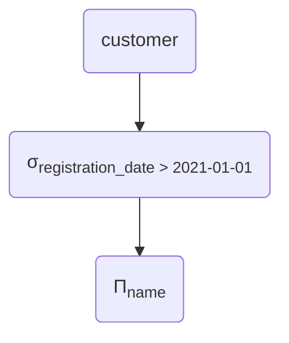
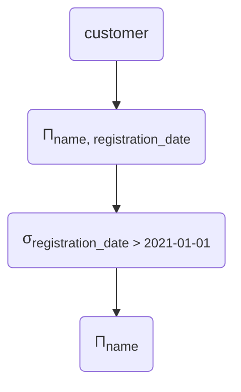
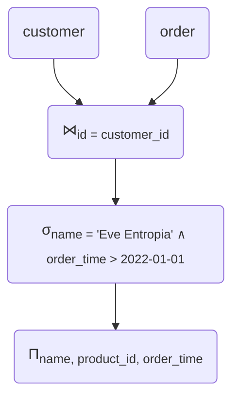
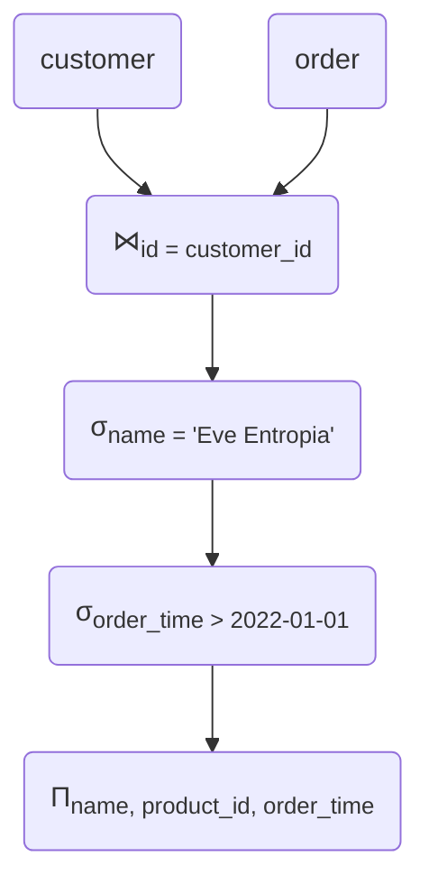
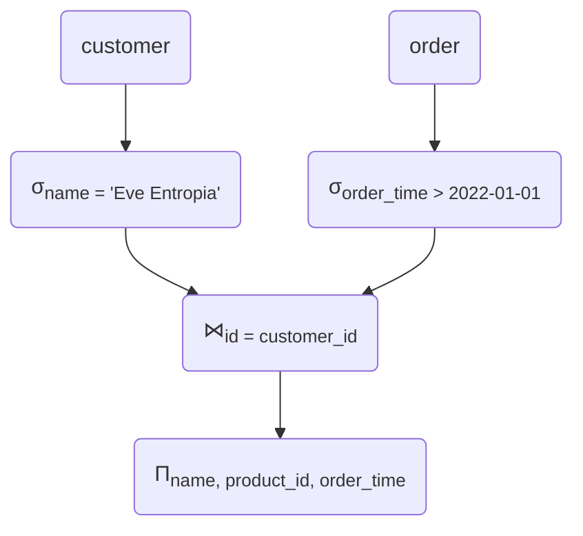
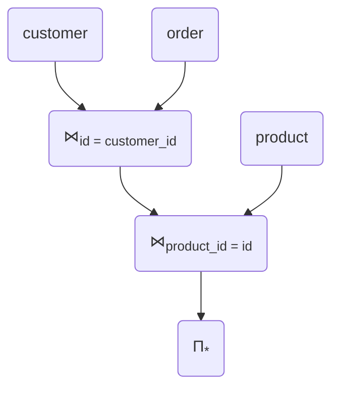

# Postgres Query Planning
## *How I learned to love the Query Planner*


---
layout: statement
---

# Two parts

## Some fundamentals

## How does Postgres do it?

<!--
* some theory, relational Algebra, some ideas for optimisation
* actual postgres query plans, how to read them, how the planner works
-->

---
layout: section
---

# Part I: Relational Algebra

*yawn*

<!--
* theoretical foundation
* won't go super in depth, but some useful concepts
-->

---
layout: default
---

## A simple database

### `customer`
@src: ./markdown/tables/customer_full.md

<br />
<br />

### `order`
@src: ./markdown/tables/order_full.md

---
layout: two-cols
---

## Projection Π

```sql {|1}
SELECT id, name
FROM customer;
```

::right::

@src: ./markdown/tables/customer_full.md

<div class='text-center text-3xl p-5'>
    <tabler-arrow-down /> Π<sub>customer_id, name</sub>
</div>

@src: ./markdown/tables/customer_projected.md

---
layout: two-cols
---

## Selection σ

```sql {|3}
SELECT id, name
FROM customer
WHERE registration_date > 2021-01-01;
```

::right::

@src: ./markdown/tables/customer_full.md

<div class='text-center text-3xl p-5'>
    <tabler-arrow-down /> σ<sub>registration_date > 2021-01-01</sub>
</div>

@src: ./markdown/tables/customer_selected.md

---
layout: two-cols
---

## Join ⋈<sub>θ</sub>

```sql {|3}
SELECT name, product_id, order_time
FROM customer
JOIN order ON (customer.id = order.customer_id)
```

@src: ./markdown/tables/customer_full.md

<div class='text-center text-3xl p-5'>
    <tabler-plus />
</div>

@src: ./markdown/tables/order_full.md

::right::

<div class='text-center text-3xl p-5'>
    <tabler-arrow-down /> ⋈<sub>id = customer_id</sub>
</div>

@src: ./markdown/tables/customer_order_join.md

---
layout: section
---

## Expression Trees

<!--
so far: just parts of queries.
Now: entire queries.
-->

---
layout: two-cols
---

```sql
SELECT name
FROM customer
WHERE registration_date > 2021-01-01;
```

::right::



---
layout: default
---

## Rule: Splitting Projections

$R$ with columns $a, b, c$.

$\Pi_{a}(R) = \Pi_{a}(\Pi_{a,b}(R))$

<v-click>

We can *throw away* some columns earlier if we want to.
</v-click>

---
layout: two-cols
---

## Optimisation: Project early

```sql
SELECT name
FROM customer
WHERE registration_date > 2021-01-01;
```

<v-clicks>

* throw away columns we don't need as early as possible
* keep selections, joins, … in mind!
</v-clicks>

::right::



---
layout: two-cols
---

## Join, where

```sql
SELECT name, product_id, order_time
FROM customer
JOIN order ON (customer.id = order.customer_id)
WHERE name = 'Eve Entropia'
AND order_time > 2022-01-01;
```

::right::



---
layout: default
---

## Rule: Splitting Selections

$$
\sigma_{a \wedge b}(R) = \\
\sigma_{a}(\sigma_{b}(R)) = \\
\sigma_{b}(\sigma_{a}(R))
$$

<v-clicks>

* conditions joined by *and* can be split
* order does not matter
</v-clicks>

---
layout: two-cols
---

## Optimisation: Push up selection

```sql {|5}
SELECT name, product_id, order_time
FROM customer
JOIN order ON (customer.id = order.customer_id)
WHERE name = 'Eve Entropia'
AND order_time > 2022-01-01;
```

::right::



---
layout: two-cols
---

## Optimisation: Push up selection


::right::



<!--
* Reduce size of intermediary sets!
* Don't need to join all customers with all orders ever (potentially huge!)
* Helps actual databases even more, as we'll see later
-->

---
layout: two-cols
---

## More complex join
```sql {|3-4}
SELECT *
FROM customer
JOIN order ON (customer.id = order.customer_id)
JOIN product ON (order.product_id = product.id);
```

<v-click>

* Or… the other way around?
</v-click>

::right::



---
layout: section
---

## Choices

<v-click>

sigh…
</v-click>

<!--
* suddenly, we have choices to make
-->

---
layout: default
---

## Ambiguities…

<v-clicks>

* Which is more efficient depends on
    * Table sizes
    * WHERE-conditions
    * actual data in the tables (!)
* And it gets worse:
    * Different join implementations
    * Indices?
</v-clicks>

---
layout: default
---

## Where we are

* Some optimisations (almost) always make sense
    * Pushing up selections
    * Projecting early
* Some choices are harder and less obvious
    * Simple rules not enough
    * But: Relational Algebra as basis for *correctnes*

<!--
* Worst thing that could happen: We optimize a query and it's *incorrect*
* So, we get a different result than the one from the 'naive' plan
ca. 20 min
-->
