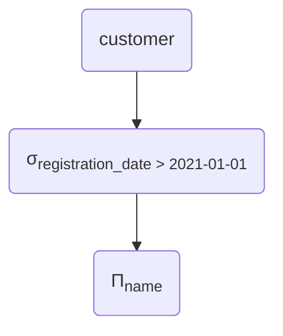
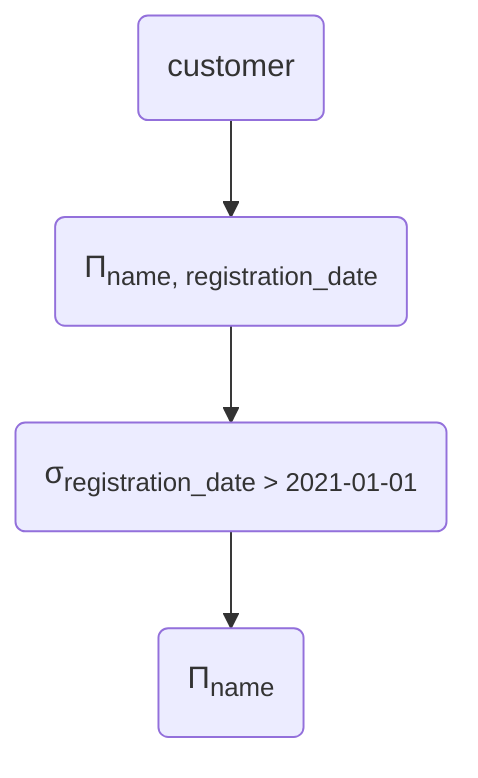
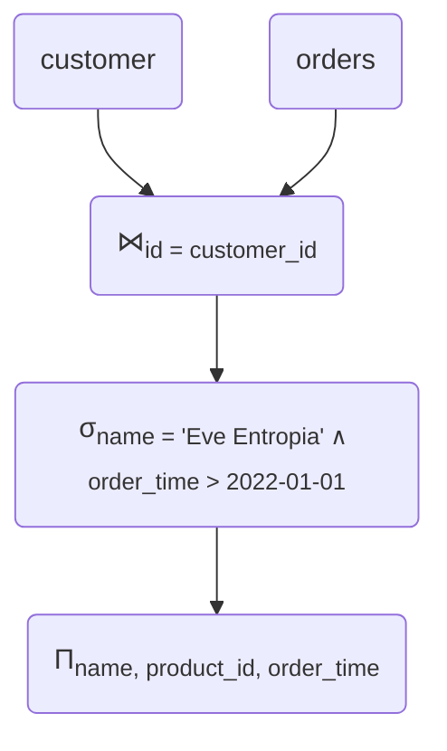
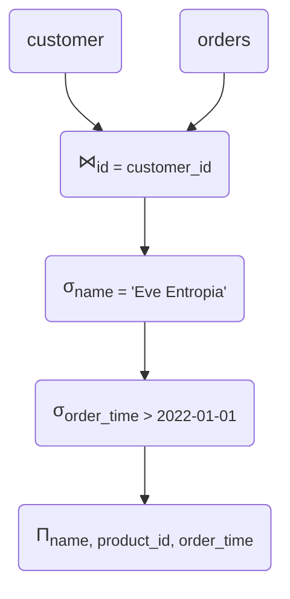
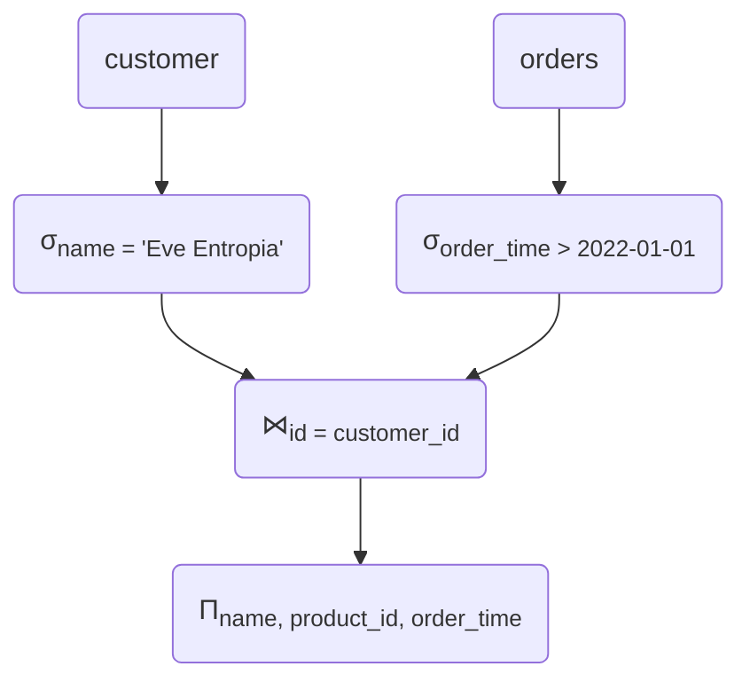
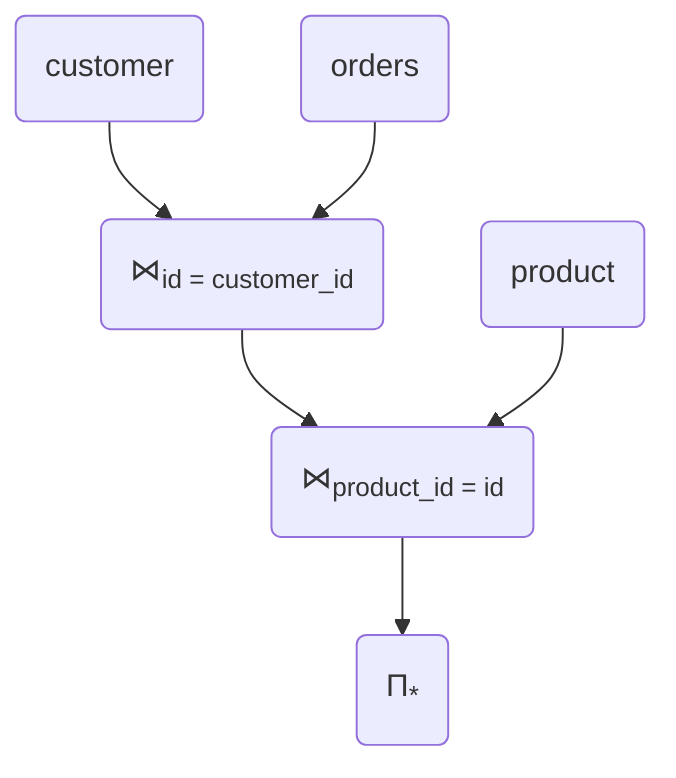
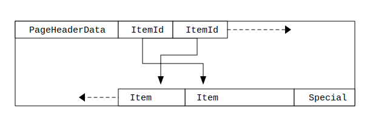

TODO: Flip graphs to match PEV2?

# Postgres Query Planning
## *How I learned to love the Query Planner*


---
layout: statement
---

# Two parts

## Some fundamentals

## How does Postgres do it?

<!--
* some theory, relational Algebra, some ideas for optimisation
* actual postgres query plans, how to read them, how the planner works
-->

---
layout: section
---

# Part I: Relational Algebra

*yawn*

<!--
* theoretical foundation
* won't go super in depth, but some useful concepts
-->

---
layout: default
---

## A simple database

### `customer`
@src: ./markdown/tables/customer_full.md

<br />
<br />

### `orders`
@src: ./markdown/tables/order_full.md

---
layout: two-cols
---

## Projection Π

```sql {|1}
SELECT id, name
FROM customer;
```

::right::

@src: ./markdown/tables/customer_full.md

<div class='text-center text-3xl p-5'>
    <tabler-arrow-down /> Π<sub>customer_id, name</sub>
</div>

@src: ./markdown/tables/customer_projected.md

---
layout: two-cols
---

## Selection σ

```sql {|3}
SELECT id, name
FROM customer
WHERE registration_date > 2021-01-01;
```

::right::

@src: ./markdown/tables/customer_full.md

<div class='text-center text-3xl p-5'>
    <tabler-arrow-down /> σ<sub>registration_date > 2021-01-01</sub>
</div>

@src: ./markdown/tables/customer_selected.md

---
layout: two-cols
---

## Join ⋈<sub>θ</sub>

```sql {|3}
SELECT name, product_id, order_time
FROM customer
JOIN orders ON (customer.id = orders.customer_id)
```

@src: ./markdown/tables/customer_full.md

<div class='text-center text-3xl p-5'>
    <tabler-plus />
</div>

@src: ./markdown/tables/order_full.md

::right::

<div class='text-center text-3xl p-5'>
    <tabler-arrow-down /> ⋈<sub>id = customer_id</sub>
</div>

@src: ./markdown/tables/customer_order_join.md

---
layout: section
---

## Expression Trees

<!--
so far: just parts of queries.
Now: entire queries.
-->

---
layout: two-cols
---

```sql
SELECT name
FROM customer
WHERE registration_date > 2021-01-01;
```

::right::



---
layout: default
---

## Rule: Splitting Projections

$R$ with columns $a, b, c$.

$\Pi_{a}(R) = \Pi_{a}(\Pi_{a,b}(R))$

<v-click>

We can *throw away* some columns earlier if we want to.
</v-click>

---
layout: two-cols
---

## Optimisation: Project early

```sql
SELECT name
FROM customer
WHERE registration_date > 2021-01-01;
```

<v-clicks>

* throw away columns we don't need as early as possible
* keep selections, joins, … in mind!
</v-clicks>

::right::



---
layout: two-cols
---

## Join, where

```sql
SELECT name, product_id, order_time
FROM customer
JOIN orders ON (customer.id = orders.customer_id)
WHERE name = 'Eve Entropia'
AND order_time > 2022-01-01;
```

::right::



---
layout: default
---

## Rule: Splitting Selections

$$
\sigma_{a \wedge b}(R) = \\
\sigma_{a}(\sigma_{b}(R)) = \\
\sigma_{b}(\sigma_{a}(R))
$$

<v-clicks>

* conditions joined by *and* can be split
* order does not matter
</v-clicks>

---
layout: two-cols
---

## Optimisation: Push up selection

```sql {|5}
SELECT name, product_id, order_time
FROM customer
JOIN orders ON (customer.id = orders.customer_id)
WHERE name = 'Eve Entropia'
AND order_time > 2022-01-01;
```

::right::



---
layout: two-cols
---

## Optimisation: Push up selection


::right::



<!--
* Reduce size of intermediary sets!
* Don't need to join all customers with all orders ever (potentially huge!)
* Helps actual databases even more, as we'll see later
-->

---
layout: two-cols
---

## More complex join
```sql {|3-4}
SELECT *
FROM customer
JOIN orders ON (customer.id = orders.customer_id)
JOIN product ON (orders.product_id = product.id);
```

<v-click>

* Or… the other way around?
</v-click>

::right::



---
layout: section
---

## Choices

<v-click>

sigh…
</v-click>

<!--
* suddenly, we have choices to make
-->

---
layout: default
---

## Ambiguities…

<v-clicks>

* Which is more efficient depends on
    * Table sizes
    * WHERE-conditions
    * actual data in the tables (!)
* And it gets worse:
    * Different join implementations
    * Indices?
</v-clicks>

---
layout: default
---

## Where we are

* Some optimisations (almost) always make sense
    * Pushing up selections
    * Projecting early
* Some choices are harder and less obvious
    * Simple rules not enough
    * But: Relational Algebra as basis for *correctnes*

<!--
* Worst thing that could happen: We optimize a query and it's *incorrect*
* So, we get a different result than the one from the 'naive' plan
ca. 20 min
-->

---
layout: section
---

# Part II: Opening Postgres' Hood

---
layout: default
---

## EXPLAIN this!
* `EXPLAIN SELECT …`: Ask database for *Query Plan*
* -> Doesn't execute query!
* Similar tree structure as relational algebra

---
layout: default
---

TODO: Table Columns of product
Mention distribution here?

---
layout: default
---

```sql
SELECT *
FROM product
WHERE number_of_foos = 0;
```

---
layout: default
class: bootstrap
---

<pev2 :plan-source="`
@src-quot: ./sql/queries/plan_number_of_foos_0.json
`" plan-query="query"></pev2>


---
layout: default
---
## How does it know?!

* Statistics!
* Collected
    * When running an `ANALYZE $table`
    * During Autovauccum

---
layout: default
---
## Statistic: Most Common Values (MVC)

```sql
SELECT
    null_frac, n_distinct, most_common_vals, most_common_freqs
FROM pg_stats
WHERE tablename='product' AND attname='number_of_foos';
```

<br/>

<v-click>

| null_frac | n_distinct | most_common_vals | most_common_freqs                             |
|-----------|------------|------------------|-----------------------------------------------|
| 0         | 4          | {2,1,3,0}        | {0.25346667,0.25033334,0.24996667,0.24623333} |
</v-click>

<br/>
<br/>

<v-click>

| 0     | 1     | 2     | 3     |
|-------|-------|-------|-------|
| 25%   | 25%   | 25%   | 25%   |
</v-click>

<br/>
<v-click>

* -> 25% of all rows have `number_of_foos = 0`
</v-click>


---
layout: default
---
## Estimating rows with MCV
* Querying for equality -> use MCV
* Even if value *not* in MCVs:
    * upper bound of matched fraction:
    * $1 - sum(most\_common\_freqs)$

---
layout: default
class: bootstrap
---
## But, is it right? EXPLAIN ANALYZE!
* Actually executes query
* Collects more Statistics
<pev2 :plan-source="`
@src-quot: ./sql/queries/plan_analyze_number_of_foos_0.json
`" plan-query="query"></pev2>

---
layout: default
class: bootstrap
---
## Let's add an index:

<pev2 :plan-source="`
@src-quot: ./sql/queries/plan_analyze_number_of_foos_0_index.json
`" plan-query="query"></pev2>

---
layout: default
---
# Sidenote: Postgres storage
* *Segment Files* (1GB) containing multiple *pages* (8KB)
* *Page* contains data for multiple *rows*
* We assume: Random order



<v-click>
more details: Postgres MVCC
</v-click>
---
layout: default
---
## Bitmap Index Scan:
* Create bitmap, one bit for each page
* Go through all rows in index
* Mark each page that needs to be accessed

## Bitmap Heap Scan:
* Go through pages returned by index
* Filter rows based on *recheck condition*

---
layout: default
class: bootstrap
---
## Back at plan with index

<pev2 :plan-source="`
@src-quot: ./sql/queries/plan_analyze_number_of_foos_0_index.json
`" plan-query="query"></pev2>

---
layout: default
---
## We want more foos!
```sql
SELECT *
FROM product
WHERE number_of_foos > 0; -- 1,2,3
```

---
layout: default
class: bootstrap
---
<pev2 :plan-source="`
@src-quot: ./sql/queries/plan_analyze_number_of_foos_gt_0.json
`" plan-query="query"></pev2>

---
layout: default
class: bootstrap
---
## Why would it seq scan?!
* Answer: *Cost*
<v-click>

* Same query, forcing it to use index scan:

<pev2 :plan-source="`
@src-quot: ./sql/queries/plan_analyze_number_of_foos_gt_0_force_index.json
`" plan-query="query"></pev2>
</v-click>

---
layout: default
---
## Cost calculation: Seq Scan
* determine number of pages of table $pages$
* determine number of rows $rows$


$$
cost = \underbrace{(pages \cdot seq\_page\_cost)}_{IO} + \underbrace{(rows \cdot cpu\_tuple\_cost)}_{CPU}
$$

* $seq\_page\_cost$: cost factor of **sequential** page access
* $cpu\_tuple\_cost$: cost factor of processing one tuple
* user configurable!

---
layout: default
---
## Cost calculation: Index Scan
* …more complicated
* but: Involves $random\_page\_cost$, which is typically set higher than $seq\_page\_cost$
    * seeking in file less performant than full read
    * especially on HDDs
* so: reading *almost all* pages (random) is **slower** than just reading *all* pages sequentialy

---
layout: default
---
## Sidenote: Tuning
* *lots* of assumtions in those cost factors!
* not necessarily accurate for flash storage
* definitely not accurate if entire DB fits in RAM!
* -> tuning might improve performance!


---
layout: default
---

## Recipe: Slow query
* EXPLAIN ANALYZE
    * look for big mismatches between estimated and actual rows
    * not using indices you think it should?
* Turn off certain planning nodes
    * compare costs with original plan
    * only ever do this for debugging!
